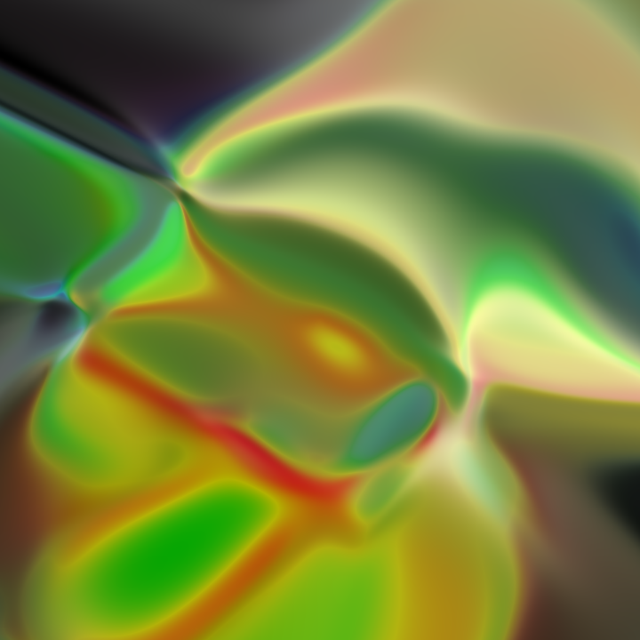
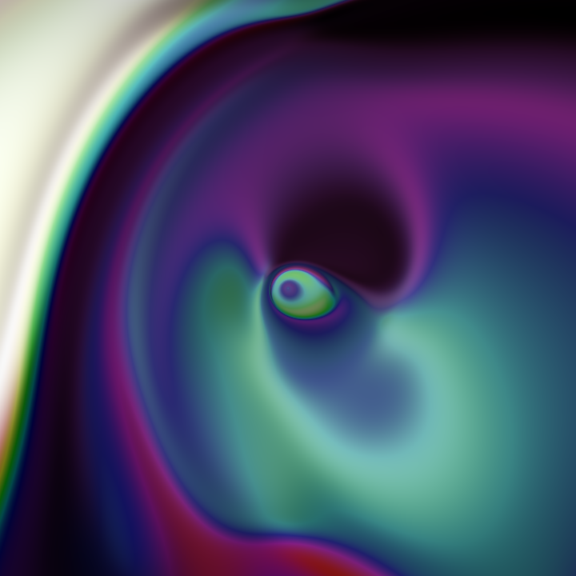
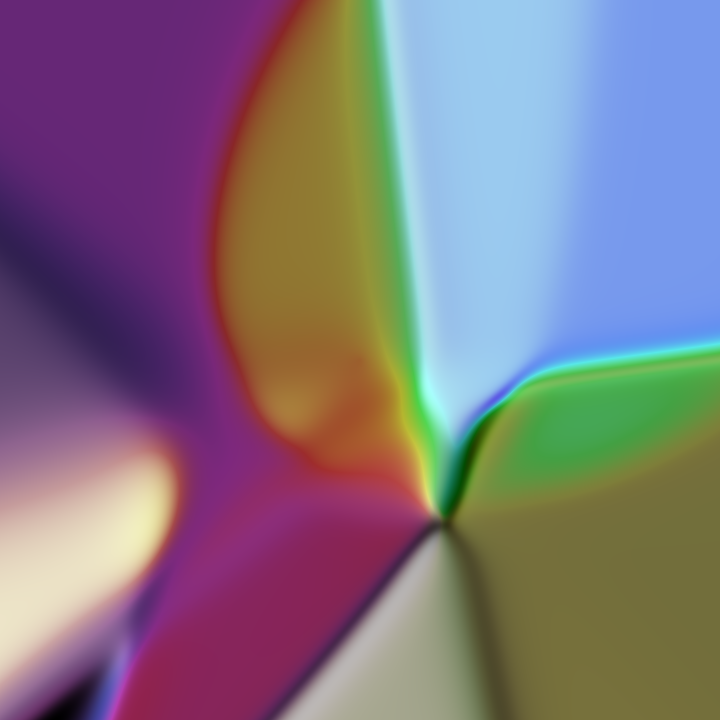
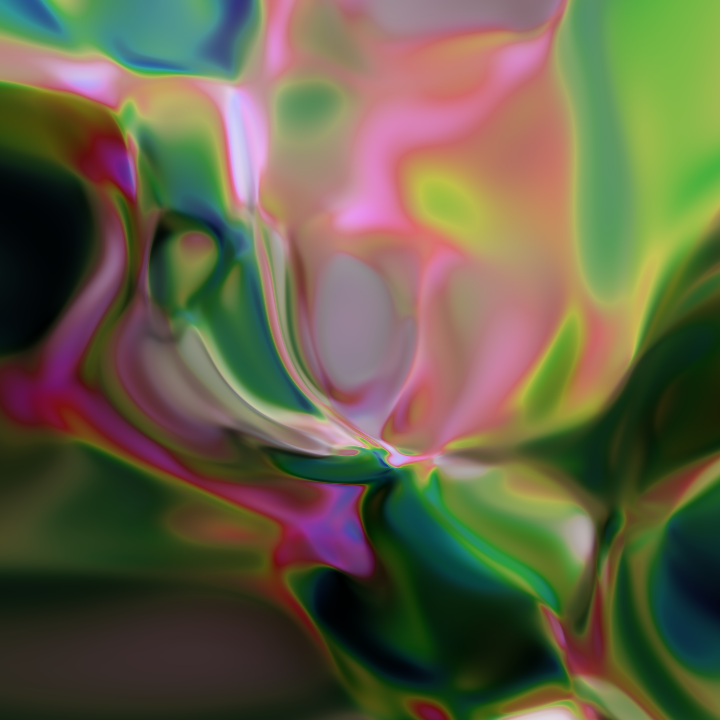
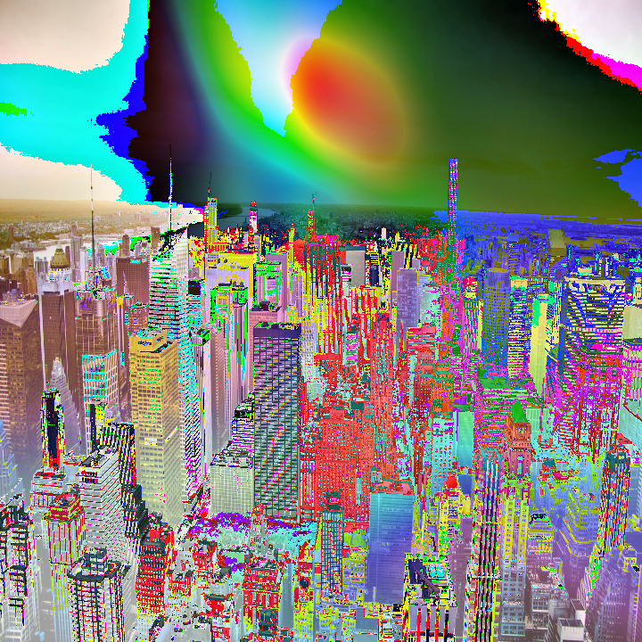

# Compositional Producing-Pattern Networks

## CPPN implementation using keras
#### This work has been inpired by other previous works:
* #### [Generating abstract patterns with tensorflow](http://blog.otoro.net/2016/03/25/generating-abstract-patterns-with-tensorflow/)
* #### [Abstract art with ml](https://janhuenermann.com/blog/abstract-art-with-ml)

### Produce abstract images and videos with neural networks
||
|:-------------------------:|
||

| | |
|:-------------------------:|:-------------------------:|
|||
||

#### You can also apply the generated patterns to an image using _apply_pattern_to_image.py_
| |
|:-------------------------:|
||
## Usage
#### The produced images can be tunned by changing the default arguments via command line
### Options
* `-p`(str) [default `./images`] output directory
* `-d` (int) [default `720`] image dimension _nxn_ 
* `-v` (float) [default `1.5`] color variance
* `-nz` (int) [default `16`] latent space dimension
* `-c` (int) [default `1`] generate color image, `0` for black and white
* `-sc`(float) [default `5.0`] scale factor
* `-nm` (str) [default `image`] image file prefix name
* `-rd` (float) [default `radius`] radius of input
* `-vn` (str) [default `video`] name of video
* `-sl` (int) [default `1`] length of video sequence
* `-fps` (int) [default `25`] number of frames per second in video
* `-lp` (int) [default `1`] repeat image sequence in video
* `-rv` (int) [default `1`] reverse sequence when repeating
* `-nhl`(int) [default `2`] number of hidden layers
* `-nu` (int) [default `32`] number of units per layer
* `-ki` (str) [default `vs`] kernel initializer, `vs` `VarianceScaling`, `normal` `RandomNormal` 
* `-g` (int) [default `0`] save gif if `1`

**Example**: create a sequence of 200 images using a radius of 1.5, variace of 6 with a neural network composed of 8 hidden layers with 64 units each. Generate gif using 20 frames per second and store in ./images
```bash
python cppnetwork.py -v 6 -nhl 8 -nu 64 -p ./images -rd 1.5 -sl 200 -fps 20 -g 1

```
